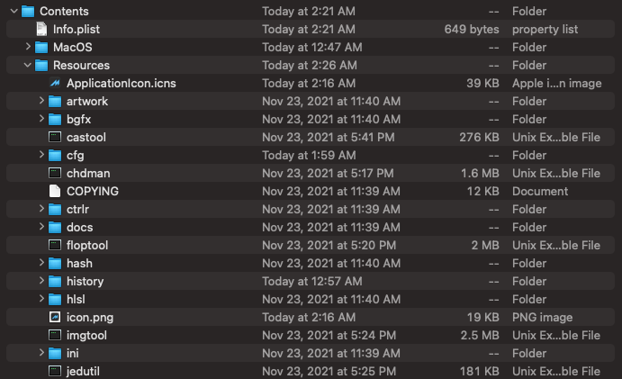

A .app template for MAME on macOS, allowing for easier and more elegant launch of MAME.

**NOTE:** I advise against placing the app in `/Applications` as this may cause permission issues.

## Instructions
* If you haven't already, download the SDL2 **Runtime Binaries** [here](http://www.libsdl.org/download-2.0.php) and follow the included readme to install it.
* Download MAME from [here](https://sdlmame.lngn.net/).
* Extract the downloaded MAME files into this repository's .app bundle (MAME.app/Contents/Resources/) as shown:  
.
* Move the bundle to anywhere you'd like, keeping my note in mind.
